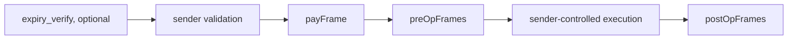
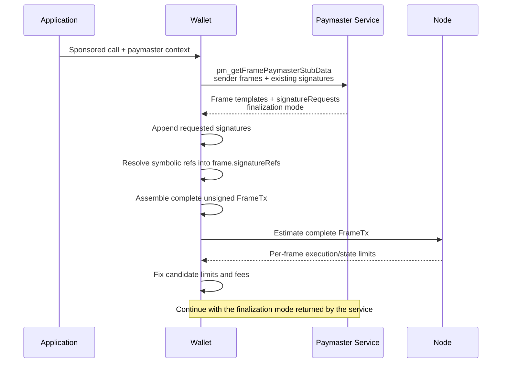
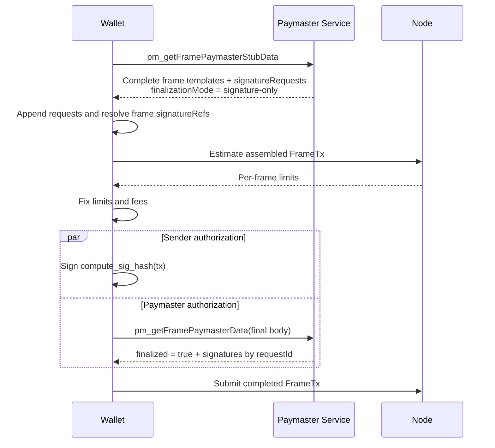
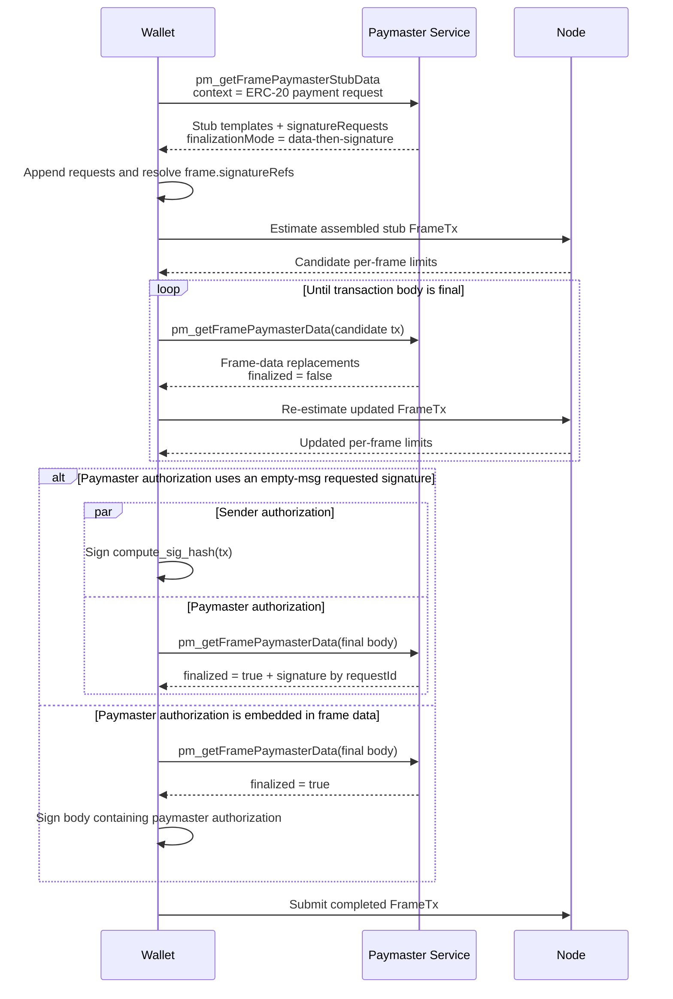

## Abstract

This EIP defines a standard interface between wallets and paymaster web services for [EIP-8141](./eip-8141.md) frame transactions. It defines two paymaster JSON-RPC methods, `pm_getFramePaymasterStubData` and `pm_getFramePaymasterData`.

The service returns paymaster-controlled frame templates and symbolic signature requests. The wallet materializes those requests into the global `tx.signatures` list and resolves each template's symbolic references into concrete EIP-8141 `frame.signature_refs`. The paymaster service never chooses or relies on a protocol-wide global signature position. Depending on the payment scheme, paymaster-controlled frame data is either fixed before estimation or finalized from candidate gas limits and fees afterward. Sender and paymaster signatures can be produced independently only after the complete transaction body and frame reference layout are fixed.

## Motivation

Paymasters are normally exposed to wallets through a web service rather than by requiring the wallet to understand a particular paymaster contract. Existing [ERC-4337](./eip-4337.md) deployments commonly use a two-stage flow: the paymaster first returns data suitable for gas estimation, and later returns final authorization data once gas and fee fields are fixed.

Frame transactions make payment approval part of the transaction execution model, but they do not remove the need for a wallet-to-paymaster service boundary. In particular:

1. The application chooses a sponsorship mode, while the wallet constructs and submits the transaction.
2. The paymaster may need to add a payment-approval frame and optional frames before or after user execution.
3. Paymaster-controlled frames must be present before the wallet can estimate the complete transaction.
4. Some payment schemes can fix all frame data before estimation, while others derive token charges or quote data from the estimated gas and fees.
5. Gas estimation should remain owned by the wallet and its selected node rather than by the paymaster service.

Without a standard interface, each provider would require a provider-specific transaction-composition and finalization flow. This EIP defines a common boundary while leaving sponsorship policy, billing, quotas, token pricing, and application-specific context to the service provider.

## Specification

The key words "MUST", "MUST NOT", "REQUIRED", "SHALL", "SHALL NOT", "SHOULD", "SHOULD NOT", "RECOMMENDED", "NOT RECOMMENDED", "MAY", and "OPTIONAL" in this document are to be interpreted as described in [RFC 2119](https://www.rfc-editor.org/rfc/rfc2119) and [RFC 8174](https://www.rfc-editor.org/rfc/rfc8174).

### Terminology

A **sender-controlled frame** is a frame constructed by the wallet from the user's requested operation or account validation logic.

A **paymaster-controlled frame** is a frame proposed by the paymaster service and inserted by the wallet. This EIP distinguishes:

- `payFrame`: the `VERIFY` frame that approves payment under EIP-8141.
- `preOpFrames`: optional non-`VERIFY` frames executed after `payFrame` and before sender-controlled execution.
- `postOpFrames`: optional non-`VERIFY` frames executed after sender-controlled execution.

A **paymaster-controlled signature** is an EIP-8141 top-level signature entry whose raw signature bytes are supplied by the paymaster service.

A **signature request** identifies one paymaster-controlled signature entry by an offchain `requestId` and supplies its final `scheme`, `signer`, and `msg` metadata. `requestId` is not included in the transaction.

A **symbolic signature reference** in a paymaster frame template refers either to an existing global signature entry supplied by the wallet or to a `requestId` returned by the service. The wallet resolves it into a concrete EIP-8141 `frame.signature_refs` index before estimation.

The **transaction body** is every transaction field except the raw `signature` bytes of top-level signature entries whose `msg` is empty. EIP-8141 elides those bytes from `compute_sig_hash(tx)`. Signature ordering, metadata, and every frame's concrete signature references remain part of the transaction body.

### Transaction construction

The wallet MUST retain ownership of the outer transaction fields and sender-controlled frames. A paymaster service MUST NOT replace the complete transaction object.

The wallet constructs a sponsored frame transaction in the following logical order:



An omitted group contributes no frames. An `expiry_verify` frame remains subject to EIP-8141 ordering rules.

The application supplies sponsorship intent and provider-defined context. The paymaster service supplies the paymaster-controlled frame plan. The wallet, not the application, composes that plan with sender-controlled frames into the final transaction.

A paymaster-controlled `SENDER` frame executes with the sender's authority and is covered by the sender's transaction signature. Wallets MUST treat such a frame as an additional user-authorized call and MUST apply the same policy and user-consent rules as for any other sender-controlled call. Paymaster services SHOULD prefer `DEFAULT` frames targeting the paymaster contract when the same operation can be implemented without sender authority.

### General service flow



### RPC transaction object

RPC methods in this EIP encode EIP-8141 frames and signatures as follows:

```typescript
type Frame = {
  mode: `0x${string}`;
  flags: `0x${string}`;
  target: `0x${string}` | null;
  limits: {
    execution: `0x${string}`;
    state: `0x${string}`;
  };
  value: `0x${string}`;
  data: `0x${string}`;
  signatureRefs: `0x${string}`[];
};

type FrameSignature = {
  scheme: `0x${string}`;
  signer: `0x${string}`;
  msg: `0x${string}`;
  signature: `0x${string}` | null;
};

type SignatureRequest = {
  requestId: string;
  scheme: `0x${string}`;
  signer: `0x${string}`;
  msg: `0x${string}`;
  signature: `0x${string}` | null;
};

type FrameSignatureReference =
  | { index: `0x${string}` }
  | { requestId: string };

type PaymasterFrameTemplate = Omit<Frame, "signatureRefs"> & {
  signatureRefs: FrameSignatureReference[];
};

type FrameTransaction = {
  chainId: `0x${string}`;
  nonce: `0x${string}`;
  sender: `0x${string}`;
  frames: Frame[];
  signatures: FrameSignature[];
  fees: {
    maxPriorityFeePerGas: `0x${string}`;
    maxFeePerGas: `0x${string}`;
    maxFeePerBlobGas: `0x${string}`;
  };
  blobVersionedHashes: `0x${string}`[];
};

type PaymasterFinalizationMode =
  | "none"
  | "signature-only"
  | "data-then-signature";
```

A stub frame MAY use zero gas limits. The wallet replaces those limits with estimates before finalization.

Before calling the paymaster service, the wallet MUST include every existing sender-controlled signature entry and every concrete `signatureRefs` binding already required by account validation. Raw signature bytes MAY remain `null` where EIP-8141 estimation permits a placeholder.

The paymaster service requests additional signatures through `signatureRequests` without assigning global indices. The wallet MUST append those entries to `tx.signatures` in response order, retain a `requestId` to global-index mapping in offchain state, and replace every symbolic `{ requestId }` reference in the returned frame templates with the allocated index. An `{ index }` reference addresses an existing entry in the request transaction and MUST remain in bounds.

After materialization, every paymaster-controlled frame is an ordinary EIP-8141 frame with concrete `signatureRefs`. The wallet MUST preserve the complete signature-array ordering, metadata, and frame references through estimation, finalization, signing, and submission. A paymaster authorization over `compute_sig_hash(tx)` SHOULD use a requested top-level signature entry with empty `msg`. An authorization embedded in frame data is part of the transaction body and cannot use the parallel signing flow defined below.

### `pm_getFramePaymasterStubData`

Returns the paymaster-controlled transaction components required to construct an unsigned frame transaction for gas estimation.

#### Parameters

```typescript
type GetFramePaymasterStubDataParams = [
  FrameTransaction,
  Record<string, unknown>
];
```

The transaction parameter contains the sender-controlled portion of the transaction. It MUST NOT contain a `payFrame` from another paymaster service. Its `signatures` array and sender-controlled frames' `signatureRefs` MUST already contain every concrete binding required by account validation.

The `context` object is provider-defined and MAY contain policy identifiers, sponsorship modes, token preferences, billing references, or other application-specific information.

#### Result

```typescript
type GetFramePaymasterStubDataResult = {
  sponsor?: {
    name: string;
    icon?: string;
  };
  payFrame: PaymasterFrameTemplate;
  preOpFrames?: PaymasterFrameTemplate[];
  postOpFrames?: PaymasterFrameTemplate[];
  signatureRequests?: SignatureRequest[];
  finalizationMode: PaymasterFinalizationMode;
};
```

`payFrame` MUST be a valid EIP-8141 payment-approval frame shape: it MUST use `VERIFY` mode and its flags MUST request `APPROVE_PAYMENT`.

`preOpFrames` and `postOpFrames`, when returned, MUST NOT use `VERIFY` mode. The wallet inserts `preOpFrames` immediately before sender-controlled execution and `postOpFrames` immediately after it.

Each `signatureRequests` item MUST have a unique `requestId`. Its `scheme`, `signer`, and `msg` metadata are final when returned. A `signature` stub may be `null` only where EIP-8141 estimation permits a placeholder.

Each symbolic frame reference MUST contain exactly one of `index` or `requestId`. An `index` MUST refer to an existing signature entry in the request transaction. A `requestId` MUST match exactly one item in `signatureRequests`. The wallet MUST reject unknown identifiers, duplicate identifiers, out-of-bounds existing indices, or ambiguous reference objects.

The wallet appends `signatureRequests` in response order and resolves every frame template into a concrete `Frame`. The resulting global index is never interpreted as a sender or paymaster role by validation code; the concrete frame reference supplies the binding, and `SIGPARAM` addresses it through the frame-local reference position.

When `payFrame` targets the EIP-8141 canonical paymaster, the service MUST return exactly one empty-`msg` `SECP256K1` signature request, `payFrame.signatureRefs` MUST contain exactly one `{ requestId }` reference to it, and `payFrame.data` MUST be empty. The materialized canonical paymaster frame therefore exposes that requested signature as local signature index `0` regardless of its global position.

The service SHOULD validate sponsorship policy during this call and SHOULD reject requests it will not sponsor before the wallet performs gas estimation.

The stub response MUST be gas-safe. For every paymaster-controlled field changed by a later response, the stub MUST provide a representation whose intrinsic calldata gas cost is greater than or equal to the final representation. If the service cannot guarantee that the same execution path fits within the estimated limits after replacement, the completed transaction MUST be estimated again.

`finalizationMode` has the following meaning:

- `none`: the service requires no post-estimation call. It MUST NOT request an empty-`msg` signature whose bytes depend on the still-unestimated transaction body.
- `signature-only`: all paymaster-controlled transaction-body fields and symbolic references are final in the stub response. After the wallet fixes frame limits and fees, the final call may fill only raw signature bytes for returned `signatureRequests`.
- `data-then-signature`: one or more paymaster-controlled frame data fields depend on estimated limits, fees, a token quote, or another post-estimation input. The sender MUST NOT sign until the service has finalized those fields and the wallet has completed any required re-estimation.

### `pm_getFramePaymasterData`

Finalizes paymaster-controlled data after candidate frame limits and fee fields have been fixed.

#### Parameters

```typescript
type GetFramePaymasterDataParams = [
  FrameTransaction,
  Record<string, unknown>
];
```

The transaction MUST contain the paymaster-controlled stub components returned by `pm_getFramePaymasterStubData`, with candidate frame limits and the wallet's candidate fee fields.

#### Result

```typescript
type GetFramePaymasterDataResult = {
  finalized: boolean;
  payFrameData?: `0x${string}`;
  preOpFrameData?: `0x${string}`[];
  postOpFrameData?: `0x${string}`[];
  signatures?: Array<{
    requestId: string;
    signature: `0x${string}`;
  }>;
};
```

The method may finalize only byte fields reserved by the stub response.

If `payFrameData` is returned, it replaces only the `data` field of `payFrame`.

If `preOpFrameData` or `postOpFrameData` is returned, its length MUST equal the corresponding stub frame array and each value replaces only the `data` field of the frame at the same position.

Each item in `signatures` MUST match a `requestId` introduced by `signatureRequests` and replaces only the raw `signature` bytes at the wallet's retained global-index mapping for that identifier. The wallet MUST reject duplicate results, unknown request identifiers, or attempts to fill an existing sender-controlled entry.

The wallet MUST reject a response that attempts to change any other transaction field. In particular, finalization MUST NOT change:

- `chainId`, `nonce`, or `sender`;
- the number, ordering, mode, flags, target, limits, value, or concrete `signatureRefs` of any frame;
- sender-controlled frame data;
- signature `scheme`, `signer`, or `msg` metadata;
- fee fields; or
- blob versioned hashes.

If a response changes any frame data, it MUST set `finalized` to `false` and MUST NOT return final signatures. The wallet applies the replacements, estimates the completed transaction again, and calls `pm_getFramePaymasterData` with the updated transaction.

A response with `finalized: true` MUST NOT change transaction-body fields. It may return only paymaster-controlled raw signature bytes. The wallet MUST reject a `finalized: true` response whose signatures are not valid for the supplied transaction.

### Signature-only finalization

A service uses `signature-only` when the stub fixes all paymaster-controlled frame data and symbolic references before estimation. The wallet materializes the requested signatures and concrete frame references before estimating. After limits and fees are fixed, the sender and paymaster sign the same transaction body independently.



This flow requires the paymaster's final response to leave the transaction body unchanged. It applies to pure sponsorship and can also apply to an ERC-20 paymaster whose frame plan derives the maximum token charge at runtime from EIP-8141 transaction introspection, such as `TXPARAM(max_cost)`, rather than encoding the estimated charge into a frame after estimation.

### Data-dependent finalization

A service uses `data-then-signature` when a paymaster-controlled frame cannot be finalized before estimation. A common example is an ERC-20 paymaster that encodes an exact maximum token charge into a token-transfer frame or embeds a quote derived from candidate limits and fees.

The application does not construct these frames. It requests an ERC-20 sponsorship mode through `context`; the paymaster service returns frame templates and symbolic signature requests, and the wallet materializes them into the user's FrameTx.



The sender cannot sign while post-estimation frame data is still changing because the sender signature commits to that data and the resulting limits. Once the body is stable, sender signing and an empty-`msg` requested paymaster signature may proceed in parallel. Signing remains strictly sequential when the paymaster authorization itself is embedded in frame data: the paymaster must produce those bytes first, the wallet must re-estimate the resulting body, and only then can the sender sign it. Services SHOULD avoid gas-dependent or embedded authorization data when the same policy can be enforced through a frame-referenced top-level signature and runtime introspection.

## Rationale

### Why the paymaster returns frames instead of opaque data

EIP-8141 does not have a `paymasterAndData` field. Payment approval is represented by a `VERIFY` frame, while token collection, settlement, and refunds can be represented by explicit frames. Returning those frame fragments preserves the native transaction model and lets the wallet inspect exactly what will execute.

### Why pre-operation and post-operation frames are explicit

An ERC-20 paymaster may need to collect a maximum token amount before user execution and refund the difference afterward. Collecting only after execution is unsafe when user execution can spend or transfer the token balance first.

Frame transactions do not need protocol-specific `preOp` or `postOp` callbacks. The service returns ordinary frames in the required positions, and EIP-8141 introspection lets a later frame inspect the gas used by earlier frames for settlement.

### Why signature requests are symbolic

EIP-8141 binds signatures to frames through consensus-level `frame.signature_refs`. A paymaster service therefore does not need to reserve a global array position or encode one into opaque frame data. It identifies each new signature with a `requestId` and expresses frame dependencies symbolically; the wallet materializes the global list and concrete references before estimation.

Appending requests in response order is only a deterministic wallet-to-service materialization rule. Validation never infers authority from the resulting global index. Each frame sees only its declared references and addresses them as local indices, so multisig accounts and independently developed paymasters compose without an implicit "paymaster is index 1" convention.

The final response remains keyed by `requestId`, allowing the wallet to place returned bytes into the materialized entry without exposing the global index as service-level semantics.

### Why signing is sometimes parallel and sometimes sequential

EIP-8141 excludes the raw bytes of empty-`msg` top-level signatures from `compute_sig_hash(tx)`. Once the transaction body and concrete frame reference layout are fixed, the sender and paymaster can therefore sign independently and their raw signatures can be combined afterward.

This does not make transaction composition parallel. If the paymaster changes frame data after seeing gas estimates, the sender must wait until those fields and the resulting limits are final. At that point top-level empty-`msg` signatures can still be produced independently. If authorization bytes are embedded in frame data instead, the sender necessarily signs after the paymaster because those bytes are part of the hash. The interface exposes this distinction rather than assuming every paymaster scheme has the same flow.

### Why body changes require re-estimation

Frame data affects intrinsic calldata cost and may alter execution paths. A successful estimate of a stub is not sufficient evidence that a modified final body fits the same per-frame execution and state limits. Re-estimating after any body change keeps the node, rather than the paymaster service, responsible for the final gas result.

### Why sponsorship policy is not standardized

Whether a transaction is sponsored may depend on API credentials, application policy, user quotas, subscriptions, token payments, exchange rates, or offchain billing. These are service-level concerns and do not change EIP-8141 transaction validity. The `context` object therefore remains provider-defined.

## Backwards Compatibility

This EIP introduces new optional paymaster JSON-RPC methods and does not change EIP-8141 consensus behavior. Existing wallets, nodes, and paymaster services remain unaffected unless they opt into this interface.

## Security Considerations

### Paymaster mutation of user intent

Wallets MUST construct the final transaction themselves and MUST reject final paymaster responses that mutate fields outside the explicitly reserved paymaster-controlled byte fields. A wallet MUST NOT submit a transaction object returned wholesale by an untrusted paymaster service.

### Paymaster-proposed sender frames

A paymaster-proposed `SENDER` frame has the sender's authority once the sender signs the transaction. Wallets MUST NOT treat such a frame as harmless service metadata. They MUST validate and present it as part of the user's authorized execution.

### Signature request and reference substitution

A malicious service could reuse a `requestId`, point a frame template at an unrelated existing signature, or return bytes for an unknown request. Wallets MUST validate every symbolic reference, allocate each request exactly once, retain the `requestId` mapping, and freeze all materialized signature metadata and concrete frame references before signing. Validation contracts must still verify the referenced entry's signer, scheme, message, and other required constraints; a frame reference scopes access but does not by itself establish authority.

### Premature sender signing

For `data-then-signature` finalization, the sender MUST NOT sign a candidate transaction before the paymaster-controlled data and final estimates are fixed. A signature over an earlier candidate does not authorize the completed transaction and must not be reused.

### Stub and final gas mismatch

A malicious or incorrect paymaster can return final data whose intrinsic or execution cost exceeds the stub used for estimation. Wallets MUST re-estimate after every transaction-body change.

### Untrusted post-operation frames

`postOpFrames` execute as part of the user's transaction. Wallets SHOULD display or policy-check these frames and MUST NOT assume that sponsorship makes them harmless. Paymaster services SHOULD minimize settlement frames and SHOULD avoid granting them authority unrelated to fee settlement.

### Service authentication and API keys

Applications commonly authenticate to paymaster services with credentials that should not be exposed to wallets. Applications MAY proxy the paymaster service through their own backend.

### Authorization expiry

Paymaster services SHOULD bind final authorization to the complete finalized transaction and SHOULD use EIP-8141 expiry mechanisms when authorization is time-limited. Wallets MUST NOT reuse final paymaster data for a materially different transaction.

## Copyright

Copyright and related rights waived via [CC0](../LICENSE.md).
