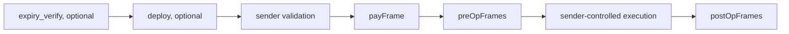
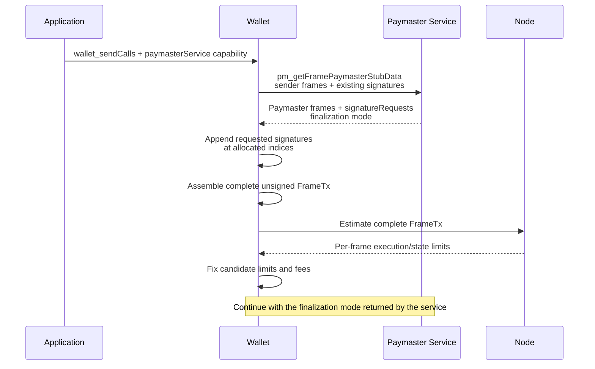
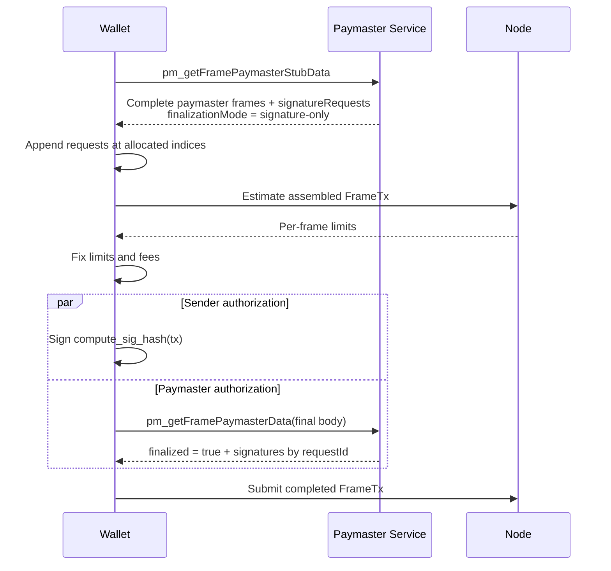
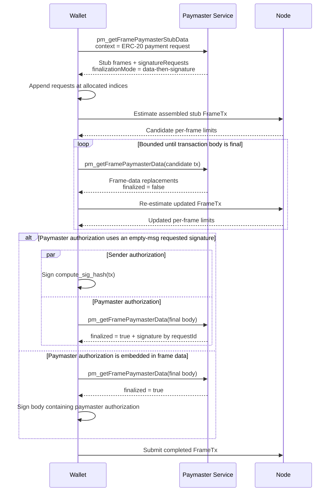

## Abstract

This EIP extends the [ERC-7677](./eip-7677.md) paymaster web service to [EIP-8141](./eip-8141.md) frame transactions. It defines two paymaster JSON-RPC methods, `pm_getFramePaymasterStubData` and `pm_getFramePaymasterData`, served at the same service URL that apps already pass to wallets through the [ERC-7677](./eip-7677.md) `paymasterService` capability of [EIP-5792](./eip-5792.md). Apps need no new integration: the wallet selects this EIP's method family when it constructs an [EIP-8141](./eip-8141.md) frame transaction and the [ERC-7677](./eip-7677.md) `pm_*` methods when it constructs an [ERC-4337](./eip-4337.md) user operation.

The service returns paymaster-controlled frames and signature requests. The wallet appends each requested signature to the global `tx.signatures` list at a deterministic index that both parties can compute at stub time, so the service never relies on a protocol-wide fixed signature position. Depending on the payment scheme, paymaster-controlled frame data is either fixed before estimation or finalized from candidate gas limits and fees afterward. Sender and paymaster signatures can be produced independently only after the complete transaction body is fixed.

## Motivation

Paymasters are normally exposed to wallets through a web service rather than by requiring the wallet to understand a particular paymaster contract. [ERC-7677](./eip-7677.md) standardized this boundary for [ERC-4337](./eip-4337.md): the app hands the wallet a service URL and opaque context through the [EIP-5792](./eip-5792.md) `paymasterService` capability, the service first returns data suitable for gas estimation, and later returns final authorization data once gas and fee fields are fixed.

Frame transactions make payment approval part of the transaction execution model, but they do not remove the need for a wallet-to-paymaster service boundary. In particular:

1. The application chooses a sponsorship mode, while the wallet constructs and submits the transaction.
2. The paymaster may need to add a payment-approval frame and optional frames before or after user execution.
3. Paymaster-controlled frames must be present before the wallet can estimate the complete transaction.
4. Some payment schemes can fix all frame data before estimation, while others derive token charges or quote data from the estimated gas and fees.
5. Gas estimation should remain owned by the wallet and its selected node rather than by the paymaster service.

The [ERC-7677](./eip-7677.md) `pm_getPaymasterStubData` and `pm_getPaymasterData` methods cannot carry this: [EIP-8141](./eip-8141.md) has no `paymasterAndData` field, payment approval is a `VERIFY` frame, and paymaster participation may span several frames and top-level signature entries. Rather than defining a new capability and forcing every app to re-integrate, this EIP keeps the [ERC-7677](./eip-7677.md) app-to-wallet surface unchanged and adds a frame-transaction method family to the same service endpoint. Sponsorship policy, billing, quotas, token pricing, and application-specific context remain provider-defined.

## Specification

The key words "MUST", "MUST NOT", "REQUIRED", "SHALL", "SHALL NOT", "SHOULD", "SHOULD NOT", "RECOMMENDED", "NOT RECOMMENDED", "MAY", and "OPTIONAL" in this document are to be interpreted as described in [RFC 2119](https://www.rfc-editor.org/rfc/rfc2119) and [RFC 8174](https://www.rfc-editor.org/rfc/rfc8174).

### Relationship to ERC-7677 and EIP-5792

This EIP reuses the [ERC-7677](./eip-7677.md) `paymasterService` capability unchanged.

- **Apps** pass a `url` and optional `context` on an [EIP-5792](./eip-5792.md) `wallet_sendCalls` request exactly as specified in [ERC-7677](./eip-7677.md). No new capability field is defined.
- **Wallets** indicate support by returning the `paymasterService` capability as `supported: true` from [EIP-5792](./eip-5792.md) `wallet_getCapabilities`, exactly as specified in [ERC-7677](./eip-7677.md). A wallet constructing an [EIP-8141](./eip-8141.md) frame transaction uses the `pm_getFramePaymasterStubData` / `pm_getFramePaymasterData` methods defined here; a wallet constructing an [ERC-4337](./eip-4337.md) user operation uses the [ERC-7677](./eip-7677.md) `pm_*` methods. The wallet MUST forward the capability's `context` object verbatim to every method defined in this EIP.
- **Services** that support multiple account models SHOULD implement all applicable method families at the same URL. A service that does not implement this EIP's methods returns JSON-RPC `-32601` (Method not found); the wallet treats that as "no frame-transaction support at this endpoint". Service endpoints SHOULD use path-based major versioning (e.g. `/v1`); additive optional fields are backwards-compatible within a version and clients MUST ignore unknown fields.

Because the provided paymaster may ultimately not be used (service failure, or a user selecting a wallet-provided alternative), apps MUST NOT assume the service they pass is the entity that pays, matching [ERC-7677](./eip-7677.md).

### Terminology

A **sender-controlled frame** is a frame constructed by the wallet from the user's requested operation or account validation logic.

A **paymaster-controlled frame** is a frame proposed by the paymaster service and inserted by the wallet. This EIP distinguishes:

- `payFrame`: the `VERIFY` frame that approves payment under [EIP-8141](./eip-8141.md).
- `preOpFrames`: optional non-`VERIFY` frames executed after `payFrame` and before sender-controlled execution.
- `postOpFrames`: optional non-`VERIFY` frames executed after sender-controlled execution.

A **paymaster-controlled signature** is an [EIP-8141](./eip-8141.md) top-level signature entry whose raw signature bytes are supplied by the paymaster service.

A **signature request** identifies one paymaster-controlled signature entry by an offchain `requestId` and supplies its final `scheme`, `signer`, and `msg` metadata. `requestId` is not included in the transaction.

The **allocated index** of a signature request is the global position its entry receives in `tx.signatures`. The wallet appends requested entries in response order, so the `k`-th request (zero-based) in `signatureRequests` receives allocated index `len(signatures)` + `k`, where `len(signatures)` is the length of the `signatures` array in the request transaction. Both the wallet and the service can compute every allocated index at stub time from the request alone.

The **transaction body** is every transaction field except the raw `signature` bytes of top-level signature entries whose `msg` is empty. [EIP-8141](./eip-8141.md) elides those bytes from `compute_sig_hash(tx)`. Signature ordering and metadata remain part of the transaction body.

### Transaction construction

The wallet MUST retain ownership of the outer transaction fields and sender-controlled frames. A paymaster service MUST NOT replace the complete transaction object.

The wallet constructs a sponsored frame transaction in the following logical order:



An omitted group contributes no frames. `expiry_verify` and `deploy` frames are sender-controlled and remain subject to [EIP-8141](./eip-8141.md) ordering rules; the resulting `[expiry_verify?] [deploy?] only_verify pay` shape matches the [EIP-8141](./eip-8141.md) public-mempool validation prefixes.

The application supplies sponsorship intent and provider-defined context. The paymaster service supplies the paymaster-controlled frame plan. The wallet, not the application, composes that plan with sender-controlled frames into the final transaction.

A paymaster-controlled `SENDER` frame executes with the sender's authority and is covered by the sender's transaction signature. Wallets MUST treat such a frame as an additional user-authorized call and MUST apply the same policy and user-consent rules as for any other sender-controlled call. Paymaster services SHOULD prefer `DEFAULT` frames targeting the paymaster contract when the same operation can be implemented without sender authority.

### General service flow



### RPC transaction object

RPC methods in this EIP encode [EIP-8141](./eip-8141.md) frames and signatures as follows. The `Frame` object mirrors the consensus frame fields exactly:

```typescript
type Frame = {
  mode: `0x${string}`;
  flags: `0x${string}`;
  target: `0x${string}` | null;
  limits: {
    execution: `0x${string}`;
    state: `0x${string}`;
  };
  value: `0x${string}`;
  data: `0x${string}`;
};

type FrameSignature = {
  scheme: `0x${string}`;
  signer: `0x${string}`;
  msg: `0x${string}`;
  signature: `0x${string}` | null;
};

type SignatureRequest = {
  requestId: string;
  scheme: `0x${string}`;
  signer: `0x${string}`;
  msg: `0x${string}`;
  signature: `0x${string}` | null;
};

type FrameTransaction = {
  chainId: `0x${string}`;
  nonce: `0x${string}`;
  sender: `0x${string}`;
  frames: Frame[];
  signatures: FrameSignature[];
  fees: {
    maxPriorityFeePerGas: `0x${string}`;
    maxFeePerGas: `0x${string}`;
    maxFeePerBlobGas: `0x${string}`;
  };
  blobVersionedHashes: `0x${string}`[];
};

type TokenPaymentInfo = {
  token: `0x${string}`;
  symbol?: string;
  decimals?: number;
  maxAmount: `0x${string}`;
  feeRecipient?: `0x${string}`;
};

type PaymasterFinalizationMode =
  | "none"
  | "signature-only"
  | "data-then-signature";
```

A stub frame MAY use zero gas limits. The wallet replaces those limits with estimates before finalization. How the wallet obtains per-frame estimates — a frame-transaction gas estimation node RPC, or local simulation — is out of scope for this EIP and is being specified separately.

Before calling the paymaster service, the wallet MUST include every existing sender-controlled signature entry required by account validation. Raw signature bytes MAY remain `null` where the wallet's estimation interface accepts placeholder signature bytes.

#### Signature allocation

The paymaster service requests additional signatures through `signatureRequests` without naming global positions. The wallet MUST append those entries to `tx.signatures` in response order, so each request receives the allocated index defined in [Terminology](#terminology). The wallet MUST retain the `requestId`-to-allocated-index mapping in offchain state and MUST NOT insert, remove, or reorder signature entries afterward. Because allocated indices are a pure function of the request transaction and the response order, the service can compute them at stub time and, when its paymaster contract addresses a signature through the [EIP-8141](./eip-8141.md) `SIGPARAM` instruction, encode the allocated index into the paymaster-controlled frame data it returns. Alternatively, a paymaster contract MAY locate its entry by scanning `tx.signatures` metadata through `SIGPARAM`. Validation contracts MUST NOT infer authority from a signature's position alone; they must verify the referenced entry's `scheme`, `signer`, and `msg` through `SIGPARAM` metadata.

After the wallet appends the requested entries, every paymaster-controlled frame is an ordinary [EIP-8141](./eip-8141.md) frame. The wallet MUST preserve the complete signature-array ordering and metadata through estimation, finalization, signing, and submission. A paymaster authorization over `compute_sig_hash(tx)` SHOULD use a requested top-level signature entry with empty `msg`, since [EIP-8141](./eip-8141.md) elides such raw bytes from the signature hash. An authorization embedded in frame data is part of the transaction body and cannot use the parallel signing flow defined below.

### `pm_getFramePaymasterStubData`

Returns the paymaster-controlled transaction components required to construct an unsigned frame transaction for gas estimation.

#### Parameters

```typescript
type GetFramePaymasterStubDataParams = [
  FrameTransaction,
  Record<string, unknown>
];
```

The transaction parameter contains the sender-controlled portion of the transaction. It MUST NOT contain a `payFrame` from another paymaster service. Its `signatures` array MUST already contain every entry required by account validation.

The `context` object is the opaque context from the `paymasterService` capability, forwarded verbatim. It is provider-defined and MAY contain policy identifiers, sponsorship modes, token preferences, billing references, or other application-specific information.

#### Result

```typescript
type GetFramePaymasterStubDataResult = {
  sponsor?: {
    name: string;
    icon?: string;
  };
  payFrame: Frame;
  preOpFrames?: Frame[];
  postOpFrames?: Frame[];
  signatureRequests?: SignatureRequest[];
  tokenPayment?: TokenPaymentInfo;
  finalizationMode: PaymasterFinalizationMode;
  ttl?: number;
};
```

`sponsor` carries display information for the sponsoring party, with the same requirements as [ERC-7677](./eip-7677.md): `icon` MUST be a data URI as defined in RFC-2397, the image SHOULD be a square with 96x96px minimum resolution in a lossless or vector format, and wallets MUST render SVG images using an `` tag so no untrusted JavaScript can execute.

`payFrame` MUST be a valid [EIP-8141](./eip-8141.md) payment-approval frame shape: it MUST use `VERIFY` mode and its flags MUST request `APPROVE_PAYMENT`.

`preOpFrames` and `postOpFrames`, when returned, MUST NOT use `VERIFY` mode. The wallet inserts `preOpFrames` immediately before sender-controlled execution and `postOpFrames` immediately after it.

Each `signatureRequests` item MUST have a unique `requestId`. Its `scheme`, `signer`, and `msg` metadata are final when returned. A `signature` stub may be `null` only where the wallet's estimation interface accepts placeholder signature bytes. The wallet MUST reject duplicate request identifiers.

When `payFrame` targets an [EIP-8141](./eip-8141.md) canonical paymaster instance, the service MUST return exactly one empty-`msg` `SECP256K1` signature request for the paymaster's authorized signer, and MUST populate `payFrame.data` as the canonical paymaster implementation requires, including any signature-index encoding that implementation defines. This EIP does not itself define the canonical paymaster's signature-location convention; that is owned by [EIP-8141](./eip-8141.md).

`tokenPayment`, when returned, is display metadata for a token-payment scheme: the wallet SHOULD present `maxAmount` of `token` (rendered with `symbol` and `decimals` when provided) as the maximum charge the user authorizes, with `feeRecipient` identifying the collecting address when it differs from the paymaster contract. `tokenPayment` is informational only; it does not replace the wallet's validation and display of the frames that actually move tokens, and a mismatch between `tokenPayment` and the returned frames SHOULD be treated as a malformed response.

`ttl`, when returned, is the number of seconds from receipt for which this stub response, including any quote behind it, remains valid. After `ttl` elapses without the sender having signed, the wallet MUST restart from `pm_getFramePaymasterStubData`. Services whose responses embed market-dependent quotes SHOULD return a `ttl`.

The service SHOULD validate sponsorship policy during this call and SHOULD reject requests it will not sponsor, using the [error codes](#errors) below, before the wallet performs gas estimation.

The stub response MUST be gas-safe. For every paymaster-controlled field changed by a later response, the stub MUST provide a representation whose intrinsic calldata gas cost is greater than or equal to the final representation. If the service cannot guarantee that the same execution path fits within the estimated limits after replacement, the completed transaction MUST be estimated again.

`finalizationMode` has the following meaning:

- `none`: the service requires no post-estimation call. It MUST NOT request an empty-`msg` signature whose bytes depend on the still-unestimated transaction body.
- `signature-only`: all paymaster-controlled transaction-body fields are final in the stub response. After the wallet fixes frame limits and fees, the final call may fill only raw signature bytes for returned `signatureRequests`.
- `data-then-signature`: one or more paymaster-controlled frame data fields depend on estimated limits, fees, a token quote, or another post-estimation input. The sender MUST NOT sign until the service has finalized those fields and the wallet has completed any required re-estimation.

### `pm_getFramePaymasterData`

Finalizes paymaster-controlled data after candidate frame limits and fee fields have been fixed.

#### Parameters

```typescript
type GetFramePaymasterDataParams = [
  FrameTransaction,
  Record<string, unknown>
];
```

The transaction MUST contain the paymaster-controlled stub components returned by `pm_getFramePaymasterStubData`, with candidate frame limits and the wallet's candidate fee fields.

#### Result

```typescript
type GetFramePaymasterDataResult = {
  finalized: boolean;
  payFrameData?: `0x${string}`;
  preOpFrameData?: `0x${string}`[];
  postOpFrameData?: `0x${string}`[];
  signatures?: Array<{
    requestId: string;
    signature: `0x${string}`;
  }>;
  tokenPayment?: TokenPaymentInfo;
  ttl?: number;
};
```

The method may finalize only byte fields reserved by the stub response.

If `payFrameData` is returned, it replaces only the `data` field of `payFrame`.

If `preOpFrameData` or `postOpFrameData` is returned, its length MUST equal the corresponding stub frame array and each value replaces only the `data` field of the frame at the same position.

Each item in `signatures` MUST match a `requestId` introduced by `signatureRequests` and replaces only the raw `signature` bytes at the wallet's retained allocated index for that identifier. The wallet MUST reject duplicate results, unknown request identifiers, or attempts to fill an existing sender-controlled entry.

`tokenPayment`, when returned, updates the display metadata defined above, for example with the exact charge derived from the candidate limits and fees. The same informational-only rules apply.

The wallet MUST reject a response that attempts to change any other transaction field. In particular, finalization MUST NOT change:

- `chainId`, `nonce`, or `sender`;
- the number, ordering, mode, flags, target, limits, or value of any frame;
- sender-controlled frame data;
- the number or ordering of signature entries, or any signature `scheme`, `signer`, or `msg` metadata;
- fee fields; or
- blob versioned hashes.

If a response changes any frame data, it MUST set `finalized` to `false` and MUST NOT return final signatures. The wallet applies the replacements, estimates the completed transaction again, and calls `pm_getFramePaymasterData` with the updated transaction. `ttl` on a non-final response bounds how long the returned data remains valid for that next call. Services SHOULD converge in a single round: a non-final response SHOULD return data that will not change again given unchanged estimates. Wallets SHOULD bound the finalization loop — RECOMMENDED at most two non-final rounds — and surface a failure to the user instead of looping against a service that does not converge.

A response with `finalized: true` MUST NOT change transaction-body fields. It may return only paymaster-controlled raw signature bytes. The wallet MUST reject a `finalized: true` response whose signatures are not valid for the supplied transaction.

### Errors

Payment-domain rejections from both methods use the JSON-RPC error code `-32000` with a structured `data` payload:

```typescript
type PaymasterRejectedData = {
  code: PaymasterErrorCode;
  reason?: string; // human-readable detail for display/logs
};

type PaymasterErrorCode =
  | "POLICY_REJECTED"         // calls/sender/contract not covered by policy for this intent
  | "SENDER_INELIGIBLE"       // sender blocklisted or missing a required attestation
  | "BUDGET_EXHAUSTED"        // sponsorship budget or sender allowance depleted
  | "GAS_EXCEEDS_LIMIT"       // transaction cost exceeds the service's per-transaction ceiling
  | "UNSUPPORTED_TOKEN"       // requested payment token not accepted
  | "INVALID_TRANSACTION"     // malformed transaction, or stub components missing/altered
  | "QUOTE_EXPIRED"           // the stub response's ttl elapsed; restart from the stub call
  | "TEMPORARILY_UNAVAILABLE" // service degraded; retry shortly
  | string;                   // services MAY return their own codes
```

Wallets MUST branch on the `code` string, MUST treat unknown codes as opaque, and SHOULD display `reason` when present. Standard JSON-RPC codes (`-32600`, `-32601`, `-32602`, `-32603`, `-32700`) keep their protocol meanings and are reserved for protocol-level faults rather than sponsorship policy.

### Signature-only finalization

A service uses `signature-only` when the stub fixes all paymaster-controlled frame data before estimation. The wallet appends the requested signatures at their allocated indices before estimating. After limits and fees are fixed, the sender and paymaster sign the same transaction body independently.



This flow requires the paymaster's final response to leave the transaction body unchanged. It applies to pure sponsorship and can also apply to an [ERC-20](./eip-20.md) paymaster whose frame plan derives the maximum token charge at runtime from [EIP-8141](./eip-8141.md) transaction introspection, such as `TXPARAM(max_cost)`, rather than encoding the estimated charge into a frame after estimation.

### Data-dependent finalization

A service uses `data-then-signature` when a paymaster-controlled frame cannot be finalized before estimation. A common example is an [ERC-20](./eip-20.md) paymaster that encodes an exact maximum token charge into a token-transfer frame or embeds a quote derived from candidate limits and fees.

The application does not construct these frames. It requests an [ERC-20](./eip-20.md) sponsorship mode through `context`; the paymaster service returns frames and signature requests, and the wallet composes them into the user's FrameTx.



The sender cannot sign while post-estimation frame data is still changing because the sender signature commits to that data and the resulting limits. Once the body is stable, sender signing and an empty-`msg` requested paymaster signature may proceed in parallel. Signing remains strictly sequential when the paymaster authorization itself is embedded in frame data: the paymaster must produce those bytes first, the wallet must re-estimate the resulting body, and only then can the sender sign it. Services SHOULD avoid gas-dependent or embedded authorization data when the same policy can be enforced through a top-level signature and runtime introspection.

## Rationale

### Why an ERC-7677 extension instead of a new capability

Apps that sponsor transactions already pass a `paymasterService` URL and context through [EIP-5792](./eip-5792.md). The account model behind a given sender is the wallet's concern, not the app's: the same app-provided service URL should work whether the wallet builds an [ERC-4337](./eip-4337.md) user operation or an [EIP-8141](./eip-8141.md) frame transaction. Reusing the capability keeps discovery (`wallet_getCapabilities`) and configuration (`wallet_sendCalls`) untouched, and pushes the only real difference — the transaction shape crossing the wallet-to-service boundary — into a parallel method family that providers can add to an existing endpoint.

### Why the paymaster returns frames instead of opaque data

[EIP-8141](./eip-8141.md) does not have a `paymasterAndData` field. Payment approval is represented by a `VERIFY` frame, while token collection, settlement, and refunds can be represented by explicit frames. Returning those frame fragments preserves the native transaction model and lets the wallet inspect exactly what will execute.

### Why pre-operation and post-operation frames are explicit

An [ERC-20](./eip-20.md) paymaster may need to collect a maximum token amount before user execution and refund the difference afterward. Collecting only after execution is unsafe when user execution can spend or transfer the token balance first.

Frame transactions do not need protocol-specific `preOp` or `postOp` callbacks. The service returns ordinary frames in the required positions, and [EIP-8141](./eip-8141.md) introspection lets a later frame inspect the gas used by earlier frames for settlement.

### Why signature placement is deterministic rather than negotiated

[EIP-8141](./eip-8141.md) carries one global `tx.signatures` list, addressed by global index through `SIGPARAM`. A paymaster service could in principle demand a fixed position ("the paymaster is always index 1"), but that convention breaks composition: the number of sender-controlled entries varies by account, and independently developed services cannot coordinate positions.

Instead, the request transaction fixes the existing entries and the append-in-response-order rule makes every requested entry's global index a pure function of data both parties already hold. The service computes each allocated index at stub time and encodes it into its own frame data when its contract needs it — the same convention [EIP-8141](./eip-8141.md) anticipates for contracts that must locate a specific entry: pass the index as an argument in frame data rather than assume a position from the frame's approval mode. Fixed positions ("sender is index 0, paymaster is index 1") break as soon as an account needs more than one signature, such as a multisig, so this EIP never assigns meaning to a position. Validation contracts still verify the entry's signer, scheme, and message through `SIGPARAM` metadata — a position never establishes authority by itself. The final response stays keyed by `requestId` so returned bytes land in the right entry even if a wallet's internal bookkeeping differs.

This convention is also stable under future signature aggregation, one of the stated reasons [EIP-8141](./eip-8141.md) keeps signatures in a separate top-level list: aggregation elides raw signature bytes, not entries. `compute_sig_hash(tx)` already blanks the raw bytes of empty-`msg` entries while committing the list's order and every entry's metadata, so an allocated index embedded in signed frame data continues to identify the same logical signature even when its witness bytes are aggregated away.

### Why signing is sometimes parallel and sometimes sequential

[EIP-8141](./eip-8141.md) excludes the raw bytes of empty-`msg` top-level signatures from `compute_sig_hash(tx)`. Once the transaction body is fixed, the sender and paymaster can therefore sign independently and their raw signatures can be combined afterward.

This does not make transaction composition parallel. If the paymaster changes frame data after seeing gas estimates, the sender must wait until those fields and the resulting limits are final. At that point top-level empty-`msg` signatures can still be produced independently. If authorization bytes are embedded in frame data instead, the sender necessarily signs after the paymaster because those bytes are part of the hash. The interface exposes this distinction rather than assuming every paymaster scheme has the same flow.

### Why body changes require re-estimation

Frame data affects intrinsic calldata cost and may alter execution paths. A successful estimate of a stub is not sufficient evidence that a modified final body fits the same per-frame execution and state limits. Re-estimating after any body change keeps the node, rather than the paymaster service, responsible for the final gas result.

### Why error codes are standardized but sponsorship policy is not

Whether a transaction is sponsored may depend on API credentials, application policy, user quotas, subscriptions, token payments, exchange rates, or offchain billing. These are service-level concerns and do not change [EIP-8141](./eip-8141.md) transaction validity, so the `context` object remains provider-defined. The *shape* of a refusal, however, is what wallets must render and act on: a small canonical code vocabulary lets a wallet distinguish "retry later" from "never for this sender" across providers, while the open `string` union leaves room for provider-specific conditions.

## Backwards Compatibility

This EIP is a pure extension of [ERC-7677](./eip-7677.md): it introduces new optional paymaster JSON-RPC methods at the same service endpoint and reuses the existing `paymasterService` capability unchanged. Existing [ERC-7677](./eip-7677.md) apps, wallets, and services remain unaffected unless they opt into this interface, and nothing here changes [EIP-8141](./eip-8141.md) consensus behavior.

## Security Considerations

### Paymaster mutation of user intent

Wallets MUST construct the final transaction themselves and MUST reject final paymaster responses that mutate fields outside the explicitly reserved paymaster-controlled byte fields. A wallet MUST NOT submit a transaction object returned wholesale by an untrusted paymaster service.

### Paymaster-proposed sender frames

A paymaster-proposed `SENDER` frame has the sender's authority once the sender signs the transaction. Wallets MUST NOT treat such a frame as harmless service metadata. They MUST validate and present it as part of the user's authorized execution.

### Signature request substitution

A malicious service could reuse a `requestId`, return bytes for an unknown request, or attempt to fill a sender-controlled entry. Wallets MUST validate that request identifiers are unique, allocate each request exactly once, retain the `requestId`-to-index mapping, and freeze all signature metadata and ordering before signing. Validation contracts must still verify the referenced entry's signer, scheme, message, and other required constraints; a signature's position in `tx.signatures` does not by itself establish authority.

### Premature sender signing

For `data-then-signature` finalization, the sender MUST NOT sign a candidate transaction before the paymaster-controlled data and final estimates are fixed. A signature over an earlier candidate does not authorize the completed transaction and must not be reused.

### Stub and final gas mismatch

A malicious or incorrect paymaster can return final data whose intrinsic or execution cost exceeds the stub used for estimation. Wallets MUST re-estimate after every transaction-body change.

### Stale quotes

A stub or non-final response used after its `ttl` may encode pricing the service no longer honors, surfacing as a `QUOTE_EXPIRED` rejection or, worse, a signed transaction the service refuses to co-authorize. Wallets MUST track `ttl` from receipt time and restart from the stub call once it elapses, and SHOULD bound the finalization loop as specified above rather than retrying a degraded service indefinitely.

### Untrusted post-operation frames

`postOpFrames` execute as part of the user's transaction. Wallets SHOULD display or policy-check these frames and MUST NOT assume that sponsorship makes them harmless. Paymaster services SHOULD minimize settlement frames and SHOULD avoid granting them authority unrelated to fee settlement.

### Sponsor display metadata

`sponsor` and `tokenPayment` are unauthenticated display hints from the service. Wallets MUST render SVG sponsor icons via `` per the rules above, MUST NOT let display metadata substitute for validating the frames that actually execute, and SHOULD treat a `tokenPayment` object inconsistent with the returned frames as a malformed response.

### Service authentication and API keys

Applications commonly authenticate to paymaster services with credentials that should not be exposed to wallets. Applications MAY proxy the paymaster service through their own backend, as recommended by [ERC-7677](./eip-7677.md).

### Authorization expiry

Paymaster services SHOULD bind final authorization to the complete finalized transaction and SHOULD use [EIP-8141](./eip-8141.md) expiry mechanisms, such as an `expiry_verify` frame, when authorization is time-limited. Wallets MUST NOT reuse final paymaster data for a materially different transaction.

## Copyright

Copyright and related rights waived via [CC0](../LICENSE.md).
